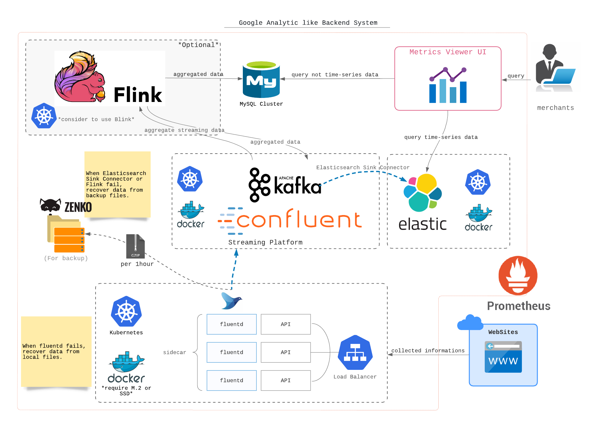

# Google Analytic like Backend System

*Feel free to choose any open source tools as you want.* とのことですが, クラウドサービスについては言及がなかったため, クラウドサービスに依存しない形で考えました.

## 主な構成

1. Webサイトから情報を受け取るAPI
2. APIが受け取ったデータを格納するストリーミング・ストレージ
3. APIが受け取ったデータをバックアップするオブジェクト・ストレージ
4. 時系列データへの高速クエリを提供する時系列データストア
5. 監視システム
6. ストリーミング・データ集計

*MySQL Cluster以外のアプリケーションはすべて, オートスケール・メリットから [Kubernetes](https://kubernetes.io/) + [Docker](https://www.docker.com/) 上での動作を考えています.*  

## 詳細

### 1. Webサイトから情報を受け取るAPI

API を提供するサーバは [Kubernetes](https://kubernetes.io/) 上で動作するマイクロサービスで, モダン且つある程度の高速性を担保できる言語で作成されたものを想定しています.  
ex. モダンである程度の高速性を担保できる言語: Rust, Golang, Scala, etc.  
> 自分で決定できる場合は, 開発チームのスキル・メンテナンス性, 周囲のエコ環境, 挑戦要素などを鑑みて決めてきました.  

APIサーバは受け取ったデータをファイルに書き出す想定です.  
ファイルに追記されたデータは逐次 [fluentd](https://www.fluentd.org/) で [Apache Kafka](https://kafka.apache.org/) に送信します.  

*[Docker](https://www.docker.com/) とファイル書き出しの相性はあまり良くないのですが, [fluentd](https://www.fluentd.org/) がfailしたときにローカル・ファイルから復旧可能なように敢えてファイルに書き出すようにしています.*  

*よってAPIサーバを駆動するノードはSSD以上の書き込み速度をもつディスク(M.2など)を備えていることが望ましいです.*

### 2. APIが受け取ったデータを格納するストリーミング・ストレージ

[Confluent](https://www.confluent.io/) - [Apache Kafka](https://kafka.apache.org/) を採用しました.  
クラウドで提供されているサービス群を除けば, ストリーム・データ処理基盤のデファクトと言っても良いのではないでしょうか.  

### 3. APIが受け取ったデータをバックアップするオブジェクト・ストレージ

S3と互換性の高い [Zenko](https://www.zenko.io/) を採用しましたが, ある程度のサイズ以上のオブジェクトが日別・時間別に保存できれば他のものでも良いところです.  

*消失したストリーミング・データを復旧したいときはここに保管されているファイルから復旧することを想定しています.*  

### 4. 時系列データへの高速クエリを提供する時系列データストア

[Elasticsearch](https://www.elastic.co/jp/products/elasticsearch) を採用しました.  
時系列データの高速クエリだけではなく, [過去データをRollUpで圧縮](https://www.elastic.co/guide/en/elasticsearch/reference/master/xpack-rollup.html) できるなど運用上欲しくなる機能が搭載されているように思います.  

[Apache Druid](https://druid.apache.org/) の使用も検討したのですが, 依然チャレンジングなところがあり, `Millions merchants` であることから, [Elasticsearch](https://www.elastic.co/jp/products/elasticsearch) を選択しました. 

### 5. 監視システム

[Kubernetes](https://kubernetes.io/), コンテナ監視と相性の良い [Prometheus](https://prometheus.io/) を採用しました.  

### 6. ストリーミング・データ集計

*Optional*

[Elasticsearch](https://www.elastic.co/jp/products/elasticsearch) のクエリで足りない場合には, ストリーミング・データ集計が必要かもしれません.  
Exactly-once で高耐障害性を備える [Apache Flink](https://flink.apache.org/) を採用しました.  
要件的に[Elasticsearch](https://www.elastic.co/jp/products/elasticsearch) のクエリで足りるのであれば不要です.  

処理フローのいずれかにバグがあった場合の, バックアップファイルからデータを復旧する目的で使用することもできますが, そのためだけに [Apache Flink](https://flink.apache.org/) のクラスタを用意するのは冗長に思います.  

> [Apache Flink](https://flink.apache.org/) と [Kubernetes](https://kubernetes.io/) のネイティブ・インテグレーションのために alibabaグループが開発した [Blink](https://github.com/apache/flink/tree/blink) の使用を検討したいところです.  
> ネイティブ・インテグレーションが使えないのであれば, [Kubernetes](https://kubernetes.io/) の使用をやめる方が良いです.  
